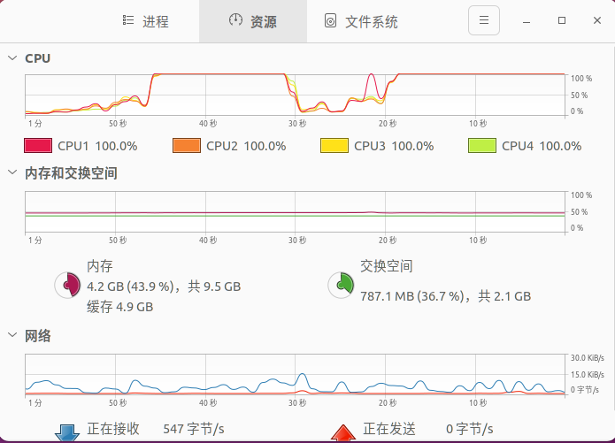

# 🚀 C++ 掌握之旅 🚀
踏上掌握 C++ 的旅程，这是一种多功能而强大的编程语言。此仓库包含有助于您学习过程的资源和个人见解。

## 1. 🎓 于仕琪 C++ 课程 🎓
在于仕琪教授的指导下，我们深入研究 C++ 的复杂性。此部分包括已完成的项目和课堂笔记。

---
## 2. 📖 C++ Primer 书籍 📖
C++ Primer 书籍是理解 C++ 的核心概念和技术的优秀资源。

## 3. 🔄 生产者和消费者 🔄
在这里，我们实现了一个多生产者，单消费者模型，有4个生产者线程和1个消费者线程。使用 `intensive_task()` 函数来测试模型的有效性.

**[点击这里查看英文版 README.md](https://github.com/Deeperfinder/Cpp_learning/asserts/README_EN.md)**
